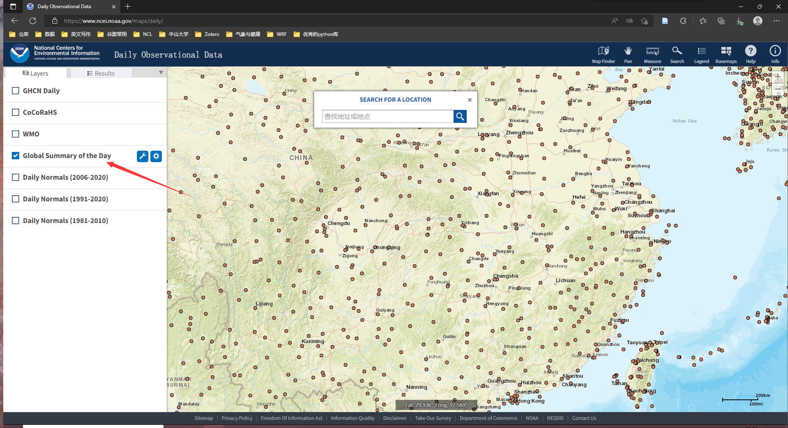

# 使用说明

## 下载NCDC气象站点信息文件 可能会需要用到VPN

* 测试数据中的命名为 station.csv

1. 进入网站：

```commandline
https://www.ncei.noaa.gov/maps-and-geospatial-products
```
2. 主界面如图所示，点击“Daily”进入下一步。

3. 勾选“Global Summeray of the Day”如图所示。

4. 框选出你需要的站点范围。

5. 在result中点击下载即可获取到station.csv


* 准备好station.csv以后，直接运行程序就可以了。